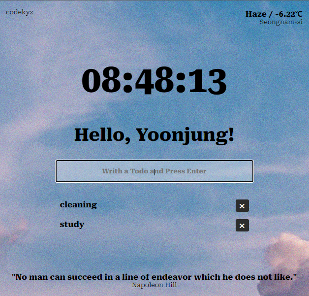

# momentum-js

[노마드코더 - 바닐라 JS로 크롬 앱 만들기](https://nomadcoders.co/javascript-for-beginners/lobby)

## JavaScript로 만드는 momentum

### 수정한 부분

- Styling
- 랜덤 명언API 사용
  - [https://api.quotable.io/random](https://api.quotable.io/random)
